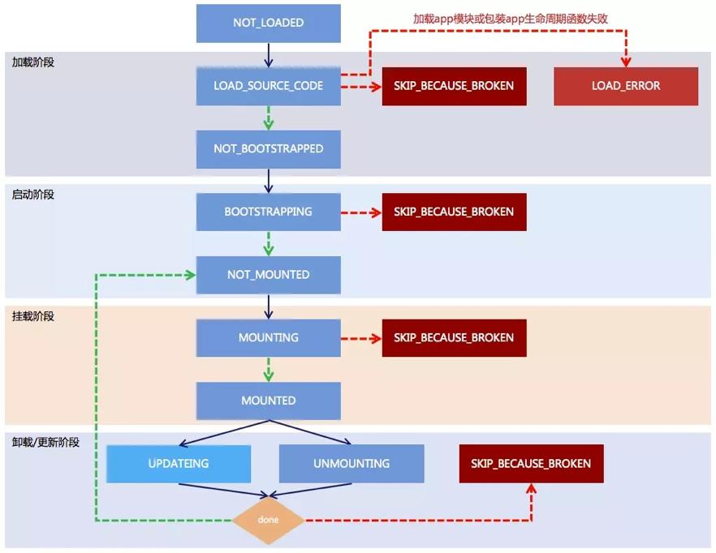

# singleSpa_code

阅读single-spa源码想要明白的问题

1. single-spa是怎么加载子应用的

2. single-spa是怎么监听路由变化的

3. single-spa是怎么切换子应用的

4. single-spa是怎么卸载不需要的应用的

5. single-spa是怎么完成全局的数据通信的（props store）

x 微前端怎么做css隔离

x 微前端怎么做js隔离



#### 先来看一下项目的文件结构

- xxx.test 比较好理解，就是测试的意思
- xxx.spec 中的 spec 是 specification 的缩写，表示规格，也就是 xxx 应该满足的规则，所以 xxx.spec.js 表示对 xxx 应该满足的规则。
- xxx.unit 中的 unit 就是单元测试的意思。

##### 主要看一下 src 下面的文件，核心代码都在 src 下面

- applications
  - app.helpers.js
    - 定义 12 个应用的状态码
    - `isActive` 判断当前应用是否已经挂载
    - `shouldBeActive` 判断应用是否应该被激活
    - `toName` 获取 app 的 name
    - `isParcel` 判断应用是否为 parcel 类型的应用
    - `objectType` 判断应用时 parcel 还是 application
  - app-errors.js
    - `handleAppError` 遍历执行错误的句柄
    - `addErrorHandler` 添加错误的句柄到错误数组中，需要是函数类型 function
    - `removeErrorHandler` 删除错误的函数句柄
    - `formatErrorMessage` 格式化错误信息
    - `transformErr` 格式化错误信息并返回错误信息
  - apps.js
    - `getAppChanges` 将应用分为四类，根据状态筛选对应的应用，返回四种状态的应用
    - `getMountedApps` 获取挂载完毕的应用对应数组
    - `getAppNames` 获取应用数组
    - `getAppStatus` 获取某个指定名字的 app 的状态
    - `registerApplication` 注册应用，也是初始化微前端的核心逻辑
    - `checkActivityFunctions` 根据 location 检测应用是否被激活
    - `unregisterApplication` 返回没有被注册的应用，并把没有注册的应用删除
    - `unloadApplication` 返回未注册的应用，返回值是个 promise
    - `validateRegisterWithConfig` 验证应用配置对象的各个属性是否存在不合法的情况，存在则抛出错误
    - `pathToActiveWhen` 函数返回 boolean 值，判断当前路由是否匹配用户给定的路径
    - `toDynamicPathValidatorRegex` 根据用户输入的 path 生成对应的正则表达式
  - timeouts.js
    - 全局的超时配置，针对应用挂载或者更新或者卸载的不同阶段，设置不同的超时时间
    - `setBootstrapMaxTime` 全局配置初始化超时时间，只针对 `bootstrap` 初始化配置
    - `setUnloadMaxTime` 全局配置移除超时时间，只针对 `unload`配置
    - `reasonableTime` 在合理的时间内执行生命周期函数，并将函数的执行结果 resolve 出去
    - `ensureValidAppTimeouts` 给每个生命周期设置超时时间
- devtools 暴露出来一些函数
- lifecycles
  - bootstraps.js 初始化 app，更改 app.status，在合理的时间内执行 bootstrap 生命周期函数，会调用 `reasonableTime`
- 入口文件

```jsx harmony
{
  input: "./src/single-spa.js";
}
```

- 入口文件导出
  - start 启动
  - ensureJQuerySupport 确保支持 jquery
  - setBootstrapMaxTime 全局配置初始化超时时间 默认 4000ms
  - setMountMaxTime 全局配置挂载超时时间 默认 3000ms
  - setUnmountMaxTime 全局配置卸载超时时间 默认 3000ms
  - setUnloadMaxTime 全局配置移除超时时间 默认 3000ms
  - registerApplication 注册子应用，调用这个方法可以在 single-spa 中注册一个应用
  - getMountedApps 当前已经挂载应用的名字。
  - getAppStatus 获取某个应用的当前状态
  - unloadApplication 在一个已经注册的应用上，调用 unload lifecyle 方法。将次应用的状态置为 NOT_LOADED。触发路由重定向，在此期间 single-spa 可能会挂载刚刚卸载的应用程序
  - checkActivityFunctions 将会调用每个应用的 mockWindowLocation 并且返回一个根据当前路判断那些应用应该被挂载的列表。
  - getAppNames 当前应用的名字（任何状态的应用）。
  - pathToActiveWhen 将字符串 URL 路径转换为活动函数。字符串路径可能包含路由参数，single-spa 将匹配任何字符
  - navigateToUrl 使用这个通用方法来轻松的实现在不同注册应用之前的切换，而不必需要处理 event.preventDefault(), pushState, triggerAppChange() 等待
  - triggerAppChange 返回一个 Promise 对象，当所有应用挂载/卸载时它执行 resolve/reject 方法，它一般被用来测试 single-spa，在生产环境可能不需要。
  - addErrorHandler 添加处理程序，该处理程序将在应用在生命周期函数或激活函数期间每次抛出错误时调用。当没有错误处理程序时，single-spa 将错误抛出到窗口
  - removeErrorHandler 删除给定的错误处理程序函数。
  - mountRootParcel 将会创建并挂载一个 single-spa parcel.注意:Parcel 不会自动卸载。卸载需要手动触发。

#### 微前端的一些基本概念

- 在 single-spa 中，有以下三种微前端类型：

  - single-spa applications:为一组特定路由渲染组件的微前端。
  - single-spa parcels(沙箱): 不受路由控制，渲染组件的微前端。
  - utility modules: 非渲染组件，用于暴露共享 javascript 逻辑的微前端。

  一个 web 应用可能包含一种或多种类型的微前端

  | 主题       | 应用程序                | 沙箱               | 公共模块                   |
  | ---------- | ----------------------- | ------------------ | -------------------------- |
  | 路由       | 有多个路由              | 无路由             | 无路由                     |
  | API        | 声明 API                | 必要的 API         | 没有 single-spa API        |
  | 渲染 UI    | 渲染 UI                 | 渲染 UI            | 不直接渲染 UI              |
  | 生命周期   | single-spa 管理生命周期 | 自定义管理生命周期 | 没有生命周期               |
  | 什么时候用 | 核心构建块              | 只需要与多个框架   | 用于共享公共逻辑或创建服务 |

  > 每个微前端都是一个浏览器内的 JavaScript 模块(说明).

  - 运行时模块，当被引用和导出时不会被构建工具编译，它直接被浏览器解析。它是与构建时模块的不同之处，他们在被浏览器解析前需要由 node_modules 提供并编译

- 告诉 webpack 和 rollup 在构建期间保留一些依赖项，以便它们来自浏览器的方法是通过 webpack externals 和 rollup externals。

  > 以下是我们的推荐:

  - 每个 single-spa 应用程序都应该是一个浏览器内的 Javascript 模块
  - 大型共享依赖(比如 react、vue 或 angular 库)应该都是浏览器内的模块。
  - 其他的都应该是构建时模块。

- JS 中的沙箱创建方式有哪些?

- “挂载”(mounted)的概念指的是被注册的应用内容是否已展示在 DOM 上

- 在一个 single-spa 页面，注册的应用会经过下载(loaded)、初始化(initialized)、被挂载(mounted)、卸载(unmounted)和 unloaded（被移除）等过程。

single-spa 会通过“生命周期”为这些过程提供钩子函数。

#### single-spa parcels(沙箱)

> import \* as singleSpa from 'single-spa'

- singleSpa.registerApplication() 入口，注册 app
  - sanitizeArguments 格式化传入的参数
  - 格式化应用配置放入 apps 数组中，
    - 这里会格式化 4 个属性，也是入口传入的 4 个参数，这里是源头
    - `status:NOT_LOADED`,后面会根据这个 status 切换状态（第一次修改状态）
    - 和 loadApp 属性（其实就是入口的第二个参数，是个函数），后面会操作这个函数
    - activeWhen
    - customProps
  - 通过 ensureJQuerySupport 增加 jquery 补丁
  - reroute(pendingPromises, eventArguments) 路由切换时触发,此时传的参数为空
    - 通过 getAppChanges 把应用分 4 类
      - 核心方法是遍历 apps，根据 status 不同，放入不同的数组
      - 第一次注册都是 NOT_LOADED，把匹配到路由的，放到了 appsToLoad 数组
      - appsToUnload 数组， 需要被移除的
      - appsToUnmount 数组， 需要被卸载的
      - appsToLoad 数组， 需要被加载的
      - appsToMount 数组， 需要被挂载的
    - 调用 isStarted()判断是否启动。事实上应用在注册是还没启动，因此这里是走 else
      - 给 appsThatChanged 赋值 appsToLoad，
      - loadApps()，返回 promise，通过微任务加载 apps
        - 遍历 appsToLoad， 每一个 app 都通过 toLoadPromise 处理
          - 重点说一下 toLoadPromise
            - 已经在被加载，直接返回状态 app.loadPromise
            - ！NOT_LOADED && ！LOAD_ERROR 没有加载或者加载失败，返回 app
            - 其它情况`app.status = LOADING_SOURCE_CODE`(第二次修改状态)状态设置为正在更改
            - 最后返回一个 app.loadPromise 的 promise，来看看 app.loadPromise
              - 通过 getProps(app)获取{customProps: '', name: '',mountParcel: '', singleSpa: '', unmountSelf: ''}
              - 把获取的参数传入 loadApp，这个 loadApp 是用户在入口传入的第二个参数。然后返回 loadPromise 的一个 promise
                - `const loadPromise = app.loadApp(getProps(app));`
                - 执行这个 promise，loadPromise.then
                  - 先加一堆校验，不符合框架规则的抛出错误
                  - 如果有 devtools 和 devtools.overlays 赋值给 app.devtools.overlays
                  - 修改状态，`app.status = NOT_BOOTSTRAPPED;`（这里应该是第三次修改状态）
                  - 挂载各种生命周期方法到 app 上
                    - app.bootstrap = flattenFnArray(appOpts, "bootstrap");
                    - app.mount = flattenFnArray(appOpts, "mount");
                    - app.unmount = flattenFnArray(appOpts, "unmount");
                    - app.unload = flattenFnArray(appOpts, "unload");
                    - app.timeouts = ensureValidAppTimeouts(appOpts.timeouts);
                  - 删除 app.loadPromise，返回 app
                  - 如果报错了就修改状态 SKIP_BECAUSE_BROKEN（运行出错）或者 LOAD_ERROR(加载失败)
        - 遍历后的 appsToLoad 返回被操作过得 app,此时的 app 已经很丰富了，此时再让每个 app 执行 callAllEventListeners
          - 来看 callAllEventListeners
            - 第一个方法 pendingPromises.forEach 其实是空数组，没执行
            - 第二个方法 callCapturedEventListeners(eventArguments)，其实也没参数
            - 所有这一次两个方法都跑空了。
        - 注册逻辑就完成了。下面该 start 逻辑了。
- singleSpa.start(opts) 参数可选

  - 这个方法会让 isStarted()返回 true
  - 前置判断 opts.urlRerouteOnly
    - setUrlRerouteOnly，定义一个全局的 urlRerouteOnly
  - 然后再调用 reroute()，启动应用，这一次调用才是真正开始注册了

    - 首先执行 appChangeUnderway = true;
    - 然后合并了四个大类的数组，生成新的 appsThatChanged 数组，`其实此时只有appsToLoad有值`
    - 最后执行 performAppChanges (因为只有 appsToLoad 有值，所有此处只执行第八步和第九步)

      - 第一步执行了浏览器自定义事件 single-spa:before-no-app-change 或者 single-spa:before-app-change
        ```jsx harmony
        window.addEventListener("single-spa:before-no-app-change", (evt) => {
          console.log("single-spa is about to do a no-op reroute");
          console.log(evt.detail.originalEvent); // PopStateEvent
          console.log(evt.detail.newAppStatuses); // { }
          console.log(evt.detail.appsByNewStatus); // { MOUNTED: [], NOT_MOUNTED: [] }
          console.log(evt.detail.totalAppChanges); // 0
        });
        ```
        - getCustomEventDetail(true)
          - 需要被加载的 && 需要被挂载的都是 设置为挂载完毕
          - 需要被卸载的 设置为没有加载过
          - 需要被卸载的 设置为没有挂载
          - 返回这个 detail，描述当前操作的 app 状态
      - 第二步执行自定义事件 single-spa:before-routing-event
        - getCustomEventDetail(true)
          - 同上
      - 第三步执行 appsToUnload.map 移除应用，返回 unloadPromises
        - toUnloadPromise
      - 第四步卸执行 appsToUnmount.map 载应用更改状态，执行 unmount 生命周期函数，卸载不需要的应用，挂载需要的应用
        - toUnmountPromise
          - 这里会把状态设置为 UNMOUNTING
        - toUnloadPromise 这里是全局最关键的一步，执行 `app.loadApp(getProps(app))`，同时把 store 的 props 传入当前触发的路由
      - 第五步 合并 unmountUnloadPromises unloadPromises 生成 allUnmountPromises
      - 第六步 执行 allUnmountPromises 返回 unmountAllPromise
      - 第七步 卸载全部完成后触发一个事件 single-spa:before-mount-routing-event
        - getCustomEventDetail
      - 第八步 遍历 appsToLoad.map

        - toLoadPromise 这里是 start 的核心逻辑，
          - tryToBootstrapAndMount
            - toBootstrapPromise
              - 最终执行的是`appOrParcel.status = BOOTSTRAPPING;`（启动中，第四次改变状态）
              - reasonableTime，要求应用在合理的时间里执行生命周期。并在切换应用时传递全局的 props `这里对数据流传递很重要`
                > 奇怪的是一直没见到 MOUNTING
              - 第五次执行生命周期 `appOrParcel.status = NOT_MOUNTED;` （第五次改变状态）此时离挂载就剩一步了。
              - 执行 toMountPromise 正式挂载
                - toMountPromise 中改变状态 `appOrParcel.status = MOUNTED;` （挂载完毕，第六次改变状态）
                - 如果执行失败，会执行 toUnmountPromise ，这里面还会修改一次状态，状态修改为 UNMOUNTING
                - toUnmountPromise 在判断 reasonableTime 后会再改变一次状态，改为 NOT_MOUNTED
                - 这时候就是开启了一个循环

      - 第九步 unmountAllPromise 执行
        - callAllEventListeners
        - 合并 loadThenMountPromises 和 mountPromises
        - 执行 finishUpAndReturn

- 更新逻辑其实和上面的步骤很多都一致，
  - 路由切换第一步就是调用 reroute
  - reroute 第一步，appChangeUnderway 骤先忽略
  - 来看第二步，还是调用 getAppChanges
    - 此时的 getAppChanges 会调用 `case MOUNTED:`，因为此时上一次的路由状态是 MOUNTED，新的路由对应的状态是 NOT_LOADED，此时 appsToLoad 和 appsToUnmount 都应该有值，
  - 来看第三步，这一步合并了两个有值的数组，赋值给 appsThatChanged ，表示这一次改变的 app
  - 然后再去执行 performAppChanges，这时的 appsToLoad 和 appsToUnmount 都是有值的
    - toUnmountPromise 会被执行， 这里状态会被重置为 `UNMOUNTING`
    - appsToLoad 会被执行

这里大概说一下核心原理

我们先来看路由时怎么注册的

首先，我们需要重写浏览器的路由切换事件，在路由切换时触发 reroute，
这个 reroute 在 `singleSpa.registerApplication()` 和 `singleSpa.start(opts)`都有调用。

我们重点看一下怎么重写的浏览器路由切换事件

loadApps 最后一步调用了 callAllEventListeners
callAllEventListeners 其实是执行了 callCapturedEventListeners

这里主要看 `navigation-event.js` 文件
callCapturedEventListeners 先注册了两个事件 hashchange popstate

> 如果是在浏览器里会执行下面的逻辑。
> single-spa 涵盖了切换浏览器 url 的 4 种方法，这几种方法最后都会调用 reroute。
> 添加 监听 hashchange 事件。
> 添加 监听 popstate 事件。
> 重写 window.history.pushState。
> 重写 window.history.replaceState。

- hashchange，hash 路由发生改变时，会调用 reroute，更新应用的状态
- popstate，用户点击浏览器的回退前进按钮触发（或者在 Javascript 代码中调用 history.back()， history.forward()）会触发。（需要注意的是调用 history.pushState()或 history.replaceState()不会触发 popstate 事件。）
- 重写 window.history 的 pushState，页面的跳转（前进后退，点击等）不重新请求页面，可以创建历史
- 重写 window.history 的 replaceState，页面的跳转（前进后退，点击等）不重新请求页面， 替换掉当前的 URL，不会产生历史。

扩展的微前端资料：https://github.com/phodal/microfrontends
